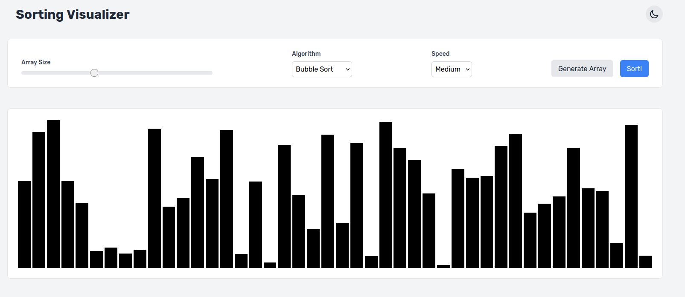
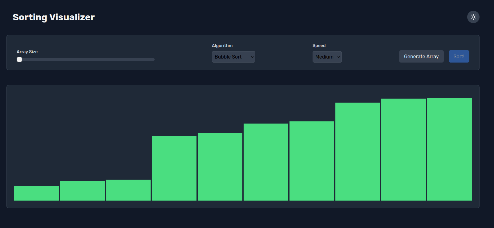
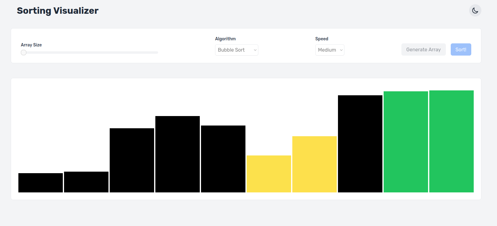

# Sorting Visualizer

LIVE: https://mckaay.github.io/sorting-visualizer/

Sorting Visualizer is an interactive web application built with Vue.js that helps users understand various sorting algorithms through animations. Users can generate an array of random numbers and watch step-by-step how different sorting algorithms operate.

## Features

- **Sorting Algorithms**: Supports multiple sorting algorithms including:
    - Bubble Sort
    - Selection Sort
    - Insertion Sort
    - Quick Sort
- **Customizable Speed**: Users can adjust the sorting speed.
- **Dynamic Array Size**: Change the number of elements in the array.
- **Real-time Visualization**: Each step in the sorting process is displayed with color-coded bars.
- **User-friendly UI**: A clean and simple interface to interact with sorting algorithms.

## Installation & Setup

### Prerequisites
Ensure you have the following installed:
- [Node.js](https://nodejs.org/)
- [npm](https://www.npmjs.com/) (comes with Node.js)

### Steps to Run

1. Clone the repository:
   ```bash
   git clone https://github.com/your-username/sorting-visualizer.git
   cd sorting-visualizer
   ```
2. Install dependencies:
   ```bash
   npm install
   ```
3. Start the development server:
   ```bash
   npm run dev
   ```
4. Open your browser and visit:
   ```
   http://localhost:5173
   ```

## Usage
- Select a sorting algorithm from the dropdown menu.
- Adjust the array size using the slider.
- Click **Generate Array** to create a new random array.
- Click **Sort!** to start the visualization.
- Adjust the speed to see sorting in action at different rates.

## Technologies Used
- **Vue.js** - Frontend framework for UI
- **JavaScript (ES6+)** - Logic and animations
- **Tailwind CSS** - Styling the visualization

## Screenshots




## Future Improvements
- Add more sorting algorithms (Merge Sort, Heap Sort, etc.)
- Improve animations with smoother transitions
- Add explanations and complexity analysis for each algorithm